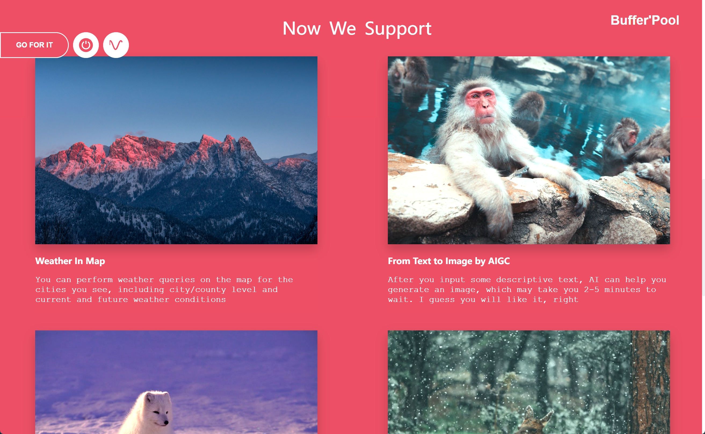
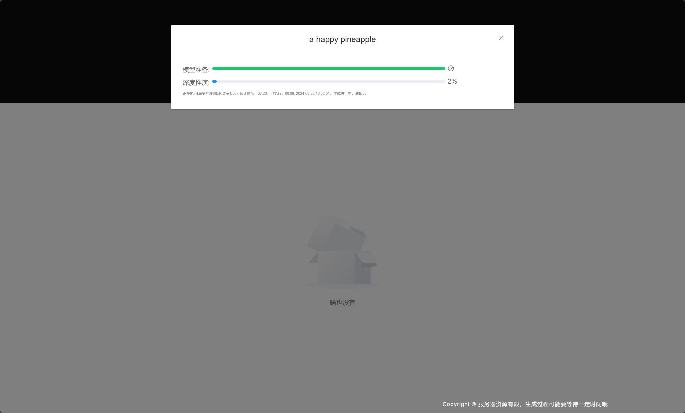

<h1 align="center" style="margin: 30px 0 30px; font-weight: bold;">欢迎加入! Welcome to join</h1>

<h4 align="center">一个开源的兴趣平台 - Buffer'Pool</h4>

&nbsp;&nbsp;在线体验：[http://seeuagain.vip](http://8.134.183.234/) 

&nbsp;&nbsp;我们的首页

&nbsp;&nbsp;至少现在已经包括了下面的内容：

<h5 align="left">1. 天气地图</h5>

&nbsp;&nbsp;你是不是总是因为外出遇到糟糕的天气而烦恼？并不是因为天气糟糕，而是没有地方可以快速查看实时或者未来的天？我知道你也有一个非常了不起的Idea，你似乎也想来一场说走就走的旅行？好吧，从今天开始，我允许你这样任性了，因为你现在有了这个工具你就可以快速知道哪儿天气不错，赶快出发吧！

<h6 align="left">简介</h6>

看图即可：

<h6 align="left">主要介绍</h6>

&nbsp;&nbsp;天气信息主要来源于：[百度地图开放平台](https://lbsyun.baidu.com/) 

&nbsp;&nbsp;前端先获取可视区域内所有城市的地理坐标，查询坐标后异步查询这些城市的天气并保存在reids里/同步到mysql，然后前端根据地理坐标懒加载查询对应的城市编号，再根据城市编号查询城市的天气，如果可视区域里面省/直辖市/省会城市数量大于5个，则只查询可视区域下的所有市级的天气，如果可视区域里地级市/市的数量小于50，则查询市/区/县的天气。查询每个地区天气前先判断redis是否有已经有这个城市的天气，如果有直接返回，如果没有，从数据库查询，如果有则异步更新redis并直接返回结果，否则去百度查询城市天气情况，查询结果异步保存到redis并设置3小时过期/保存到mysql，直接返回结果

<h5 align="left">3. AIGC-图像生成</h5>

&nbsp;&nbsp;我们新增了一个有趣的工具，这次您可以让AI来帮你生成一下图像，通过您的文本描述，我们让AI来赋值创作您喜欢的图片

<h6 align="left">简介</h6>

我们输入了一串文字描述 “大海上有一些船，岸边有人在玩耍，天空上白云一片又一片”，看图即可：

下面就是AI生成的结果：

<h6 align="left">主要介绍</h6>

&nbsp;&nbsp;大模型主要来源于GitHub开源项目：[CompVis/stable-diffusion-v1-4](https://github.com/CompVis/latent-diffusion) 

&nbsp;&nbsp;我们在本地部署了大模型，因为资源有限。借助我们的rabbitMQ进行模型推演任务下发，您在管理页面上输入文本描述后，我们将为你创建一个任务，将任务的信息推送到rabbitMQ，此时此刻，我们的大模型在本地将作为消费者处理这条消息（这个机制意味着可以部署多台服务器来作为消费者，非常轻量），并创建一个模型推演任务，根据配置信息进行图片生成，生成的同时上报生成步骤到我们的管理段，这个时候您应该处于等待阶段并看到相应的处理里程事件，我们的AI生成完的图片将被推送到管理端，此时此刻将生成的图片将被您在页面上观察到如果您有耐心等到最后并没有退出页面的话，因为在最开始我们声明过来，服务器资源有限，您不得不等待这么多时间，我们也在期待一位愿意为此买单的（女士/先生）从而为（她/他）提供非常高效的服务器资源，因为（她/他）曾为此付费并信任了这个服务

<h5 align="left">2. 小视频</h5>

&nbsp;&nbsp;我们的小视频已经可以看到效果了，看：

&nbsp;&nbsp;目前我们支持到视频上传、基于视频热点的推荐视频，一个视频播放组件

&nbsp;&nbsp;未来我们会做：

- 基于用户喜好的视频推荐、
- 视频搜索、
- 音频管理、
- 视频标签管理、
- 视频排行榜、
- 用户视频中心页、
- 通讯录，
- 视频点赞/收藏/举报/转发/下载/视频内容编辑与修改、
- 图片视频、
- 安卓客户端、鸿蒙客户端适配
- 聊天、
- 视频压缩存储
- 视频组件升级，不再使用现在的nginx静态目录管理视频资源
- 支持视频编辑以及一些视频玩法

<h5 align="left">3. 博客</h5>

&nbsp;&nbsp;这里将持续分享更多有趣的内容，欢迎大家指点江山~~~

<h4 align="left">留给最后</h4>

&nbsp;&nbsp;这意味着你可以提交任何代码，你觉得有意义的话，请把你的good idea和PR一起提交上来吧

<h4 align="left">特别鸣谢</h4>

  

