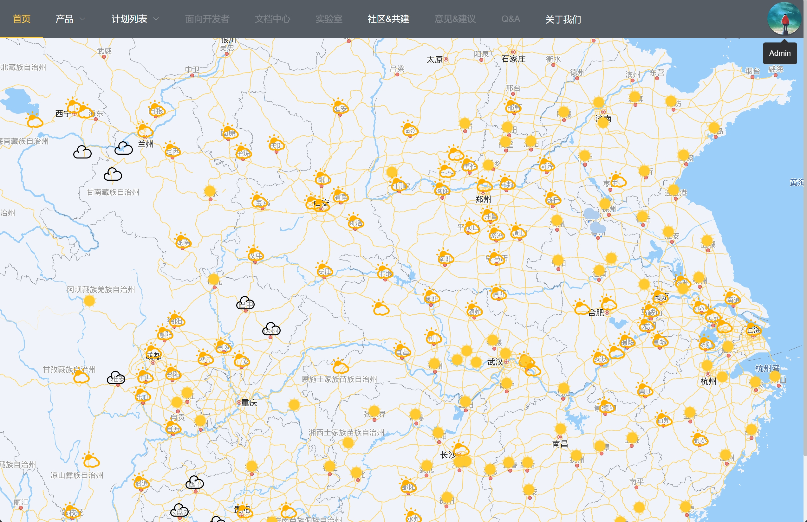

<h1 align="center" style="margin: 30px 0 30px; font-weight: bold;">欢迎加入! Welcome to join</h1>

<h4 align="center">一个开源的兴趣平台</h4>

&nbsp;&nbsp;在线体验：[http://seeuagain.vip](http://1.12.74.15/) 

&nbsp;&nbsp;至少现在已经包括了下面的内容：

<h5 align="left">1. 天气地图</h5>

&nbsp;&nbsp;你是不是总是因为外出遇到糟糕的天气而烦恼？并不是因为天气糟糕，而是没有地方可以快速查看实时或者未来的天？我知道你也有一个非常了不起的Idea，你似乎也想来一场说走就走的旅行？好吧，从今天开始，我允许你这样任性了，因为你现在有了这个工具你就可以快速知道哪儿天气不错，赶快出发吧！

<h6 align="left">简介</h6>

看图即可：

<h6 align="left">主要介绍</h6>

&nbsp;&nbsp;天气信息主要来源于：[百度地图开放平台](https://lbsyun.baidu.com/) 

&nbsp;&nbsp;前端先获取可视区域内所有城市的地理坐标，查询坐标后异步查询这些城市的天气并保存在reids里/同步到mysql，然后前端根据地理坐标懒加载查询对应的城市编号，再根据城市编号查询城市的天气，如果可视区域里面省/直辖市/省会城市数量大于5个，则只查询可视区域下的所有市级的天气，如果可视区域里地级市/市的数量小于50，则查询市/区/县的天气。查询每个地区天气前先判断redis是否有已经有这个城市的天气，如果有直接返回，如果没有，从数据库查询，如果有则异步更新redis并直接返回结果，否则去百度查询城市天气情况，查询结果异步保存到redis并设置3小时过期/保存到mysql，直接返回结果

<h5 align="left">2. 博客</h5>

&nbsp;&nbsp;这里将持续分享更多有趣的内容，欢迎大家指点江山~~~

<h4 align="left">留给最后</h4>

&nbsp;&nbsp;这意味着你可以提交任何代码，你觉得有意义的话，请把你的good idea和PR一起提交上来吧

<h4 align="left">特别鸣谢</h4>

  

